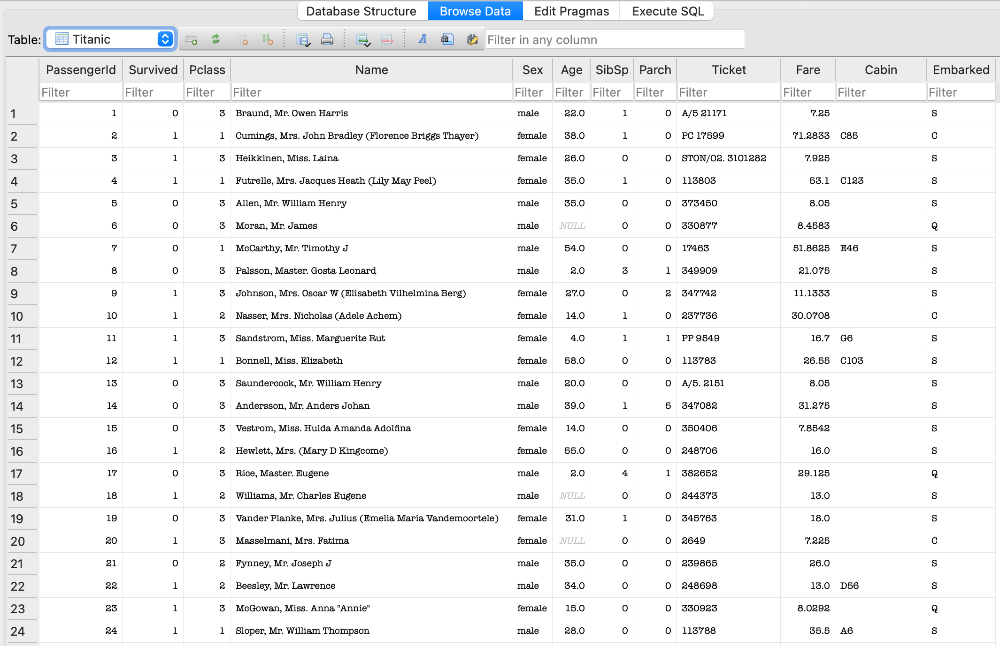

Check CI/CD Status: 

# Mini-project #5
#### Repo Title: Python Script Interacting with SQL Database
#### Author: Seijung Kim (sk591)

## Overview
This project aims to connect a SQL database and perform CRUD operations (create, read, update, and delete). The project demonstrates extracting data from a url and load the transformed data into a SQLite database. It executes ETL (Extract, Transform, Load), which is a data pipeline process that takes raw data, transforms it for analysis, and loads it into a database or analytics tool. It also performs CRUD queries and two additional SQL queries for analyzing the stored data. The `avg_fare_by_embarkation` function calculates and displays the average fare paid by passengers for each embarkation port in the Titanic dataset. The `count_survivors_by_class` function counts and displays the number of surviving passengers in each passenger class.

## Requirements
* Connect to a SQL database
* Perform CRUD operations
* Write at least two different SQL queries

Criteria: 
* Database connection (20 points)
* CRUD operations (20 points)
https://en.wikipedia.org/wiki/Create,_read,_update_and_deleteLinks to an external site.
* CI/CD pipeline (10 points)
* Test each operation works by loading the .db file into your pipeline 
* README.md (10 points)

## Contents of the Project
The project includes the files below:

* `Makefile` (with install, format, lint, test, all)
* `requirements.txt`
* `.devcontainer` (with `.devcontainer.json` and `Dockerfile`)
* `.github/workflows` for GitHub Actions (with the Matrix Build set up for different Python versions)
* In `main.py`, we execute ETL,CRUD operations, and two additional SQL queries which are `avg_fare_by_embarkation` and `count_survivors_by_class`.
* In `test_main.py`, we check if all ETL and SQL queries have ran successfully.
* In `mylib`, there are three scripts:
`extract.py`: extracts a dataset from a URL.
`query.py`: contains functions including CRUD (create, read, update, and delete) operations.
`transform_load.py`: loads the transformed data into a SQLite database table using Python's sqlite3 module.

## Dataset
# Titanic Database Schema

This project uses the Titanic passenger dataset, which is commonly used in data science for practice. The following table describes the columns and data types for the `TitanicDB.db` SQLite database.

| Column       | Data Type | Description                                                        |
|--------------|-----------|--------------------------------------------------------------------|
| PassengerId  | INTEGER   | Unique identifier for each passenger                              |
| Survived     | INTEGER   | Survival status (0 = No, 1 = Yes)                                 |
| Pclass       | INTEGER   | Passenger class (1 = 1st, 2 = 2nd, 3 = 3rd)                       |
| Name         | TEXT      | Full name of the passenger                                        |
| Sex          | TEXT      | Gender of the passenger                                           |
| Age          | REAL      | Age of the passenger (in years)                                   |
| SibSp        | INTEGER   | Number of siblings or spouses aboard                              |
| Parch        | INTEGER   | Number of parents or children aboard                              |
| Ticket       | TEXT      | Ticket number                                                     |
| Fare         | REAL      | Fare paid by the passenger                                        |
| Cabin        | TEXT      | Cabin number (if available)                                       |
| Embarked     | TEXT      | Port of embarkation (C = Cherbourg, Q = Queenstown, S = Southampton) |

## Instructions
1. Once you load this repository, wait for the installation of `requirements.txt`
2. You can run the following premade commands `make install`, `make format`, `make lint`, `make test`, or `make all`
3. When you run `main.py`, the script will execute ETL (Extract, Transform, Load) to load our data into a SQLite database for analysis. The ETL functions are stored in the Python scripts in the `mylib` folder.
4. The `test_main.py` contains functions to test the main script. You can use `make test` command to check the test results.
5. To check the full status of the CI/CD pipeline, navigate to the Actions tab of your repository on GitHub.

## Screenshot of Database Generated

This is a screenshot of the first 24 rows of data shown in `DB Browser for SQLite`:

